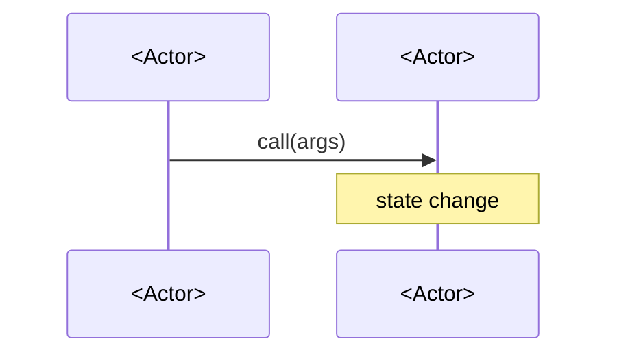

# <Component> tech design

<!-- Title line optional; a tech design may open straight at `## Background`.
     Tech designs describe HOW to implement the idea draft: Solidity-level interfaces,
     storage layouts, function signatures, gas analysis, deployment procedures. -->

## Background

<!-- DOMUS is built from scratch, so a tech design introduces the contracts for a net-new
     component rather than diffing a prior version. State which component this implements and
     the contracts it introduces, and link the idea draft it builds on, e.g.
     See [`../drafts/<component>/idea-draft.md`](../drafts/<component>/idea-draft.md).
     Reference sibling tech designs for shared concepts rather than restating them. -->

---

# General

<!-- Prose walkthrough of how the system behaves end-to-end: the actors, the passive
     vs. active paths, the core data pattern (e.g. accumulator), the units used.
     Include mermaid sequence diagrams for each primary path. -->



## Requirements

<!-- Numbered, testable behavioral requirements any implementation must satisfy. -->

1. <Requirement.>
2. <Requirement.>

---

# In depth

<!-- One `## Why ...?` / `## How ...?` subsection per design decision, recording
     the rationale one decision at a time. -->

## Why <design decision>?

<!-- The reasoning and the alternative that was rejected. -->

## How does <mechanism> work?

---

# Smart contracts

> ⚠️ The changes shown below are simplified examples intended to illustrate the expected execution flow. They are **not ready for production** and should be reviewed, validated and refined before implementation. Use them as a **reference only**, not as final code.

## `I<Component>.sol`

<!-- Interface declaring the external surface, carrying the natspec the contract
     inherits via @inheritdoc. Group as: Events, Errors, Getters, State-changing.
     Follow the project Solidity doc conventions (named params/returns). -->

```solidity
interface I<Component> {
    // Events

    // Errors

    // Getters

    // State-changing
}
```

## `<Component>.sol`

<!-- Per-function spec in prose: mutable state, constructor, then each function with
     its revert conditions, effects, emitted events, and complexity. Follow with a
     simplified reference implementation. -->

- Mutable state:
    - `<slot>`: <meaning>.
- `constructor(...)`:
    - <effects and revert conditions>
- `<function>(...)`:
    - <revert conditions, effects, events, complexity>

```solidity
contract <Component> is I<Component> {
    // reference implementation
}
```

## State transitions

This section records the storage each state-changing call touches.

> ⚠️ This section covers only the storage transitions introduced by this contract, omitting changes to other contracts mutated in the same transaction.

### `<Component>.<function>(args)`

| Storage slot | What happens |
| --- | --- |
| `<slot>` | <change> |

---

## Invariants

These properties hold at every observable state of the `<Component>`.

| ID | Invariant |
| --- | --- |
| 1 | <Invariant.> |

---

# External requirements

<!-- Conditions outside this TD's scope that must hold for the contract to behave
     as specified. Reference the owning TD for each. -->

1. <Condition.> See [`<other-td>.md`](<other-td>.md).

---

# Open questions and thoughts

No open items remain at this time.

<!-- Or numbered open items / discussion threads. -->
