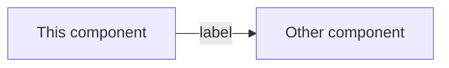
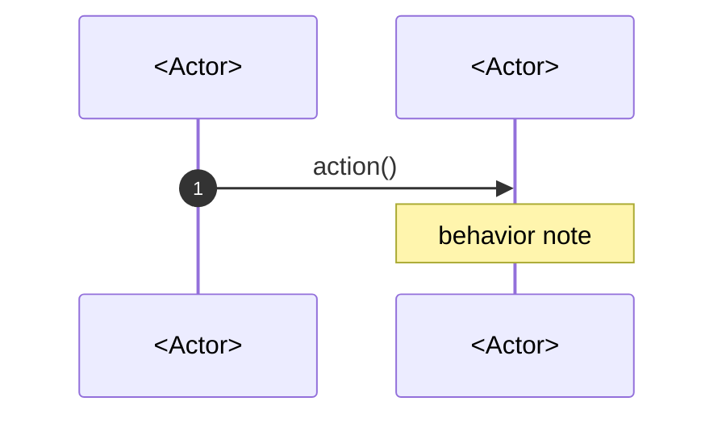

# Idea draft: <Component name>

**Status:** Draft  
**Date:** <YYYY-MM-DD>

---

## Background

<!-- DOMUS is being built from scratch, so an idea draft describes a net-new component,
     not a change to a prior version. Set the context the component lives in: the part of
     the system it belongs to and any sibling components it depends on. -->

### The problem

<!-- What gap or requirement this component addresses, and why it is needed.
     State the problem before the solution. -->

---

## What it does

<!-- One numbered subsection per capability the component provides. Describe WHAT it does
     and WHY, never HOW to implement it. No code, signatures, storage layouts, or
     architecture decisions. Readable by partners, non-technical teams, auditors. -->

### 1. <Capability name>

<!-- Behavioral description of the capability. -->

### 2. <Capability name>

### Out of scope

<!-- What this component deliberately does not do, so its boundary is unambiguous.
     Each line names the excluded behavior and where it lives instead, if anywhere. -->

- <Excluded behavior>, which is <deferred to / handled by / not planned>

---

## How it fits together

<!-- How this component relates to the rest of the system. -->

### <Flow name>

<!-- Sequence diagram per significant flow. -->

---

## Open questions

_None at this time._

<!-- Or a list of unresolved behavioral questions. Keep implementation questions
     in the tech design, not here. -->
